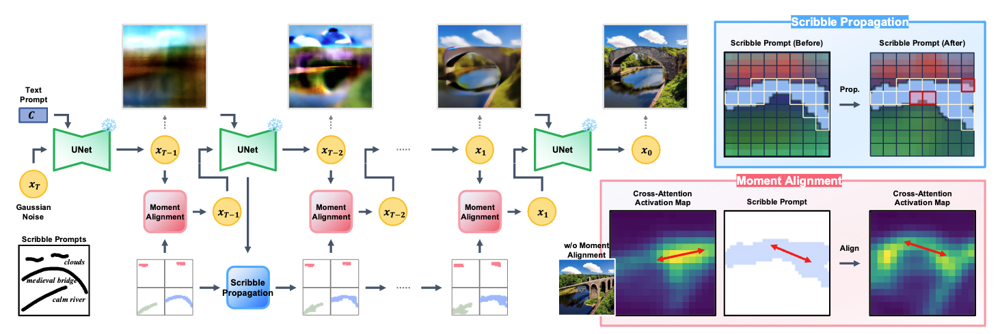

<h1 align="center">
Scribble-Guided Diffusion for<br/>Training-free Text-to-Image Generation
</h1>
<h4 align="center">
<a href="https://scholar.google.co.kr/citations?user=DFKGTG0AAAAJ&hl=en">Seonho Lee<sup>*</sup></a>, <a href="https://scholar.google.co.kr/citations?user=uvwpFpIAAAAJ&hl=en">Jiho Choi<sup>*</sup></a>, <a href="">Seohyun Lim</a>, <a href="https://scholar.google.co.kr/citations?user=i0OKV8wAAAAJ&hl=en">Jiwook Kim</a>, <a href="https://scholar.google.co.kr/citations?user=KB5XZGIAAAAJ&hl=en">Hyunjung Shim</a><br>
</h4>
<h5 align="center">
(*Equal contribution)<br>
</h5>

<h4 align="center">

[](https://arxiv.org/abs/2409.08026)
[]()

This is the official implementation of **Scribble-Guided-Diffusion**.

</h4>


<br/>

## Abstract


Recent advancements in text-to-image diffusion models have demonstrated remarkable success, yet they often struggle to fully capture the user's intent. Existing approaches using textual inputs combined with bounding boxes or region masks fall short in providing precise spatial guidance, often leading to misaligned or unintended object orientation. To address these limitations, we propose <b>Scribble-Guided Diffusion <i>(ScribbleDiff)</i></b>, a training-free approach that utilizes simple user-provided scribbles as visual prompts to guide image generation. However, incorporating scribbles into diffusion models presents challenges due to their sparse and thin nature, making it difficult to ensure accurate orientation alignment. To overcome these challenges, we introduce moment alignment and scribble propagation, which allow for more effective and flexible alignment between generated images and scribble inputs. Experimental results on the PASCAL-Scribble dataset demonstrate significant improvements in spatial control and consistency, showcasing the effectiveness of scribble-based guidance in diffusion models. Please check the paper here: [Scribble-Guided Diffusion for Training-free Text-to-Image Generation](https://arxiv.org/abs/2409.08026)


<br/>

## News & Updates

- [ ] **[TBA]** ✨ User-friendly scribble drawing tool will be released soon.

- [ ] **[TBA]** ✨ Huggingface-based code will be released soon.

- [x] **[2024/09/13]** 🌟 [LDM](https://github.com/CompVis/latent-diffusion)-based code was released. 

<br/>


## Architecture



<br/>

## Setup

First, create and activate a new conda environment:

```bash
conda create --name highlight-guided python==3.8.0
conda activate highlight-guided
conda install pytorch torchvision torchaudio pytorch-cuda=11.7 -c pytorch -c nvidia
```

Next, install the necessary dependencies:

```bash
pip install -r environments/requirements_all.txt
# if this does not work, try the following
pip install -r environments/requirements.txt
```

Install additional libraries:

```bash
pip install git+https://github.com/CompVis/taming-transformers.git
pip install git+https://github.com/openai/CLIP.git
```

Download the model [GLIGEN](https://huggingface.co/gligen/gligen-generation-text-box/blob/main/diffusion_pytorch_model.bin) trained with box-grounding tokens with text and put them in `checkpoints/gligen`


## Inference 

To create scribbles for guidance:
```bash
python draw_scribble.py
```

※ <i>We will explain how to draw and save scribbles in the future.</i>


After drawing the scribbles, save the images in the */strokes directory, for example:

```bash
examples/example1/strokes
```

Ensure the directory structure matches the configuration file paths. For instance, in `configs/config.json`:

For `config.json`

```json
"stroke_dir": "examples/example1/strokes",
"save_scribble_dir": "examples/example1/scribbles",
"save_mask_dir": "examples/example1/masks",
```


To run with user input text prompts:
```bash
python inference.py --ckpt checkpoints/gligen/text-box/diffusion_pytorch_model.bin
```

To use the default configuration file:
```bash
python inference.py --config configs/config.json
```

<br/>


※ <i>We will provide a more user-friendly and intuitive scribble drawing tool in the future.</i>

<br/>


## Acknowledgments

This project is built on the following resources:

- [**Attention Refocusing**](https://github.com/Attention-Refocusing/attention-refocusing): This is the baseline model we used in our paper.

- [**GLIGEN**](https://github.com/gligen/GLIGEN): Our code is built upon the foundational work provided by GLIGEN. 


<br/>


## Related Works

[BoxDiff: Text-to-Image Synthesis with Training-Free Box-Constrained Diffusion](https://github.com/showlab/BoxDiff)

[Dense Text-to-Image Generation with Attention Modulation](https://github.com/naver-ai/DenseDiffusion)
